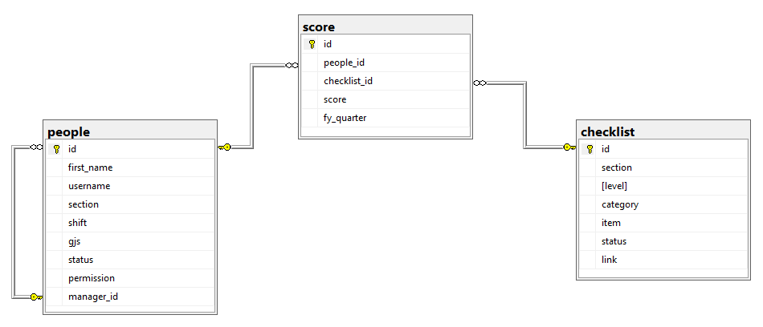

# RDA Self 2.0

Link: <http://rda-self-platform-f10-rda.bo-ose-test.micron.com/>

Source code for RDA Self 2.0

SQL database schema:  

SQL tables created using stored procedures in `sql > create` folder, including the log table  
SQL trigger for the main 3 tables are set using the stored procedure in `sql > trigger` folder, all records to the log table

---

## Prerequisite

This app is served on Node.js + Express platform.  
The app is hosted on Openshift Platform.  
Recommended to edit this code on VS Code.  
Please follow this [Development Setup](https://confluence.micron.com/confluence/display/OMELEK/Development+Setup) to install the necessary development tools.  

The following tools are needed to develop this code:  
* GIT
* Node.js and NPM (Node Package Manager)
* Visual Studio Code
* OpenShift CLI (Command Line Input), get it [here](https://www.okd.io/download.html)
* Docker

---

## Initial Setup

After you have installed the necessary development tools, open this code in its root folder using VS Code and launch terminal there.  
Copy the `template.env` file to create a new file named `.env` and fill the necessary info in the new file.  
Then run `npm install` in the terminal to install all node modules required by this code.  
Then run `nodemon` to start the server. Nodemon will auto restart the server when there's any changes to your `.js` code 

---

## Deployment

Before building the image for deployment, comment out `app.use(logger('dev'))` to silence logger in production  
Check the contents of `dockerfile` and `BuildDeploy.bat` if they are set according to your needs (e.g. project name, workspace name, etc.)  
Ensure you have `oc.exe` in the root folder and have Docker Desktop running  
From terminal, run `BuildDeploy.bat` to build and deploy your image to OpenShift, it will prompt for login credentials once  